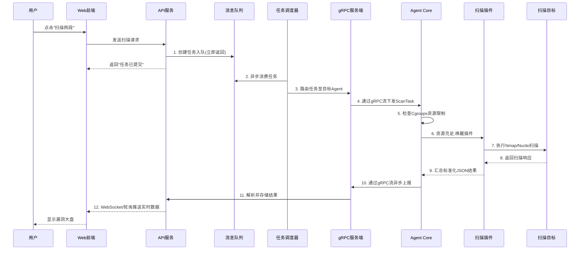

以下为你量身定制的 security-agent 改造方案，分为四个核心阶段，细化到具体操作步骤和推荐的技术栈。
阶段一：通信底座重构（将 HTTP 升级为 gRPC 双向流）
这个阶段的目标是建立稳定、低延迟的端云通信，解决“控制台无法主动推拉任务”的痛点。
 * 步骤 1.1：定义 Protobuf 协议 (IDL)
   * 新建 proto 目录，编写 .proto 文件。
   * 定义三种核心 Message：
     * Heartbeat：包含 Agent ID、Hostname、CPU/内存使用率、当前版本、存活状态。
     * ScanTask：包含任务 ID、目标 IP/网段、扫描类型（端口/漏洞/全量）、需执行的策略配置。
     * TaskResult：包含任务 ID、发现的漏洞详情（JSON 格式字符串）、扫描进度（百分比）、执行状态（成功/失败/异常）。
   * 定义 Service：使用 gRPC Bidirectional Streaming（双向流），如 rpc AgentComm (stream ClientMessage) returns (stream ServerMessage);。
 * 步骤 1.2：改造服务端 (Console) 的连接管理
   * 引入 google.golang.org/grpc。
   * 在控制台内存中维护一个 map[string]grpc.ServerStream，用于记录当前在线的 Agent ID 及其对应的通信流。
   * 实现流超时与断开重连逻辑：当心跳超过 3 分钟未上报，将其在数据库中标记为“离线”。
 * 步骤 1.3：改造 Agent 的主循环
   * 剥离旧的 HTTP 轮询代码。
   * 初始化 gRPC Client，连接控制台，并开启一个 Goroutine 定时（如 30 秒）发送 Heartbeat。
   * 开启另一个 Goroutine 监听服务端下发的 ScanTask，收到任务后，将其推入本地的 Go Channel 中等待执行。
   阶段二：Agent 架构插件化与资源管控
   确保 Agent 不会因为漏洞扫描的高负载而崩溃或拖垮宿主机。
 * 步骤 2.1：引入 HashiCorp go-plugin 或 os/exec
   * 方案 A（轻量级）：使用 os/exec 调用独立的扫描二进制文件，通过标准输出（Stdout）读取 JSON 结果。
   * 方案 B（专业级）：引入 [github.com/hashicorp/go-plugin](https://github.com/hashicorp/go-plugin)，通过 RPC 实现主 Agent 与 Scanner 进程的解耦。
   * 改造动作：将漏洞扫描逻辑从主程序剥离。主 Agent 仅负责接收指令、监控插件运行状态。
 * 步骤 2.2：实现自我保护机制 (Resource Limit)
   * 引入 [github.com/shirou/gopsutil](https://github.com/shirou/gopsutil) 获取宿主机实时状态。
   * 在执行扫描任务前，检查 CPU 使用率是否 > 80%。如果是，则暂停下发任务给插件。
   * (进阶) 在 Linux 下，使用 Go 调用 Cgroups API 为扫描插件限制 CPU 核心和内存上限（如只允许使用单核的 50%，内存不超过 500MB）。
   阶段三：集成漏洞扫描引擎核心 (Scanner 模块)
   不要自己写发包探测逻辑，直接站在巨人的肩膀上，集成开源安全生态。
 * 步骤 3.1：封装资产探测逻辑 (Nmap/Rustscan)
   * 在 Scanner 插件中，使用 os/exec 调用系统安装的 nmap，或者直接集成纯 Go 编写的端口扫描库。
   * 扫描目标开放的端口、识别服务指纹（如发现 80 端口运行 Nginx，3306 运行 MySQL）。
   * 将结果格式化并传递给下一步骤。
 * 步骤 3.2：深度集成 Nuclei SDK
   * 引入 [github.com/projectdiscovery/nuclei/v3](https://github.com/projectdiscovery/nuclei/v3) 作为核心漏洞扫描引擎。
   * 配置管理：控制台下发任务时，携带需要扫描的 CVE 模板标签（如 tags: cve,rce）。Scanner 接收后，初始化 Nuclei 引擎并应用这些模板。
   * 执行扫描：将步骤 3.1 发现的端口和服务作为输入，传入 Nuclei 引擎进行漏洞验证。
 * 步骤 3.3：结果解析与上报
   * 拦截 Nuclei 输出的 JSON Event。
   * 提取关键字段（漏洞名称、严重等级、修复建议、验证 Payload）。
   * 封装为 TaskResult Protobuf 消息，通过 gRPC 实时发送给控制台。
   阶段四：控制台任务编排与闭环
   打通控制台的扫描任务生命周期。
 * 步骤 4.1：引入轻量级任务队列 (MQ)
   * 为了防止控制台并发过高，使用 Redis (搭配 asynq 或 machinery 库) 或 RabbitMQ 建立任务队列。
   * API 接收到用户的“启动扫描”请求后，将任务写入 Redis，立即返回给前端 TaskID。
 * 步骤 4.2：开发任务调度器 (Dispatcher)
   * 控制台后台启动一个 Worker，消费 Redis 中的任务。
   * 根据任务目标 IP，查询对应的 Agent ID，通过 gRPC 找到对应的长连接流，下发 ScanTask。
 * 步骤 4.3：数据持久化与展示
   * 设计数据库表结构：assets (资产表), tasks (任务记录), vulnerabilities (漏洞表)。
   * 收到 Agent 上报的漏洞结果后，进行去重和入库。
   * 前端通过定时轮询或 WebSocket 订阅 TaskID，实时渲染扫描进度条和漏洞列表。


这份针对你 `security-agent` 项目的架构设计非常棒，清晰地勾勒出了一个**可扩展、异步解耦**的现代化漏洞扫描系统。为了让它更好地融入我们之前的对话记录，也便于你后续查阅和开发，我按照我们一贯的详细风格，将这份架构图及其核心链路，整理成了一份结构化的技术方案说明，你可以直接把它添加到之前的对话记录中。

---

### 架构设计：控制平面与执行平面解耦

本方案采用**控制平面（Console）**与**数据/执行平面（Agent）**完全解耦的微服务架构，并引入消息队列和插件化机制，以提升系统的可扩展性、健壮性和响应速度。

```mermaid
graph TD
    subgraph "控制台端 (Console / Server)"
        UI[Web 前端面板]
        API[API 服务 HTTP/REST]
        DB[(关系型数据库 MySQL/PG)]
        MQ[(任务队列 Redis/RabbitMQ)]
        Dispatcher[任务调度器 Dispatcher]
        gRPC_Server[gRPC Server 端]
    end

    subgraph "Agent 端 (Node / Host)"
        Core[Agent Core 守护进程]
        subgraph "插件层 (Plugins)"
            Scanner[漏洞扫描插件 Wrapper]
            Nmap[前置资产探测 Nmap/Portscan]
            Nuclei[漏洞验证引擎 Nuclei SDK]
        end
    end

    Target((被扫描目标 / 资产))

    %% 控制台内部数据流
    UI <-->|HTTP/REST 交互| API
    API -->|1. 创建扫描任务入队| MQ
    API <-->|读写资产与漏洞数据| DB
    Dispatcher -->|2. 异步消费任务| MQ
    Dispatcher -->|3. 路由到目标 Agent| gRPC_Server
    gRPC_Server -->|解析上报结果并入库| DB

    %% 端云核心通信
    gRPC_Server <-->|4. gRPC 双向流: 心跳保活/任务下发/结果上报| Core

    %% Agent 内部调度
    Core -->|5. 资源限制检测 (Cgroups) 通过后拉起| Scanner
    Scanner -->|内部调用| Nmap
    Scanner -->|内部调用| Nuclei

    %% 实际扫描执行
    Nmap -->|6. 端口/指纹探测| Target
    Nuclei -->|7. 发送 CVE Payload| Target
    Target -->|返回网络响应| Scanner

    %% 结果回传机制
    Scanner -->|8. 汇总标准化 JSON 结果| Core
```

---

### 核心业务链路解析

下图梳理了从任务创建到结果展示的完整数据流向，你可以结合架构图理解其闭环逻辑。



#### 链路一：任务下发 (自上而下)

1.  **用户操作**：用户在 **Web前端** 界面（如 `http://console.example.com`）发起扫描请求（例如：`POST /api/v1/scan`，参数 `{"target": "192.168.1.0/24"}`）。
2.  **接口响应**：**API 服务**接收到请求后，**不执行实际扫描**，而是将任务封装（如 `{"task_id": "uuid", "target": "192.168.1.0/24", "options": {...}}`）并立即写入 **消息队列（MQ）**（如 Redis Streams 或 RabbitMQ），向前端返回 `{"code": 0, "msg": "任务已创建", "task_id": "..."}`，实现快速响应。
3.  **异步调度**：独立的 **任务调度器（Dispatcher）** 作为后台 Goroutine/Worker，持续消费 MQ 中的任务。它根据任务中的目标或 Agent 标签，从服务发现中心或数据库获取一个健康的 **gRPC Server** 地址，并将任务转发过去。
4.  **任务推送**：**gRPC Server** 通过其与目标 **Agent Core** 之间已建立的 **gRPC 双向流**，将 `ScanTask` Protobuf 消息实时推送给 Agent。

#### 链路二：任务执行与保护 (Agent 内部)

5.  **资源预检**：**Agent Core** 接收到任务后，不会立即执行。它会首先检查宿主机当前的 **CPU、内存使用率**（通过 cgroups 或系统调用），确保扫描任务不会影响业务稳定性。如果资源紧张，任务会排队或等待。
6.  **插件唤醒**：确认资源充裕后，Agent Core 通过进程间通信（如 `os.exec` 或内部 RPC）调用 **扫描插件（Scanner Wrapper）**，并将任务参数传递给它。
7.  **分步扫描**：
    *   **资产探测**：`Scanner` 插件首先调用 **Nmap/Portscan** 模块，对目标 IP/域名进行快速端口扫描和服务指纹识别（如 `nmap -sV -p 1-10000 192.168.1.1`）。
    *   **漏洞验证**：拿到开放的端口和服务版本信息后，`Scanner` 动态生成配置，调用内嵌的 **Nuclei SDK**（一个强大的漏洞扫描引擎），使用匹配的模板向目标发送针对性的 CVE Payload 进行验证。

#### 链路三：结果上报 (自下而上)

8.  **标准化输出**：扫描过程中，**Nuclei** 等模块会实时输出发现的风险。`Scanner` 插件将这些结果（包含 `target_ip`, `port`, `cve_id`, `cvss_score`, `description` 等）汇总，格式化为统一的 **JSON** 结构。
9.  **异步回传**：`Scanner` 将 JSON 通过管道或 socket 返回给 **Agent Core**。
10. **长连接上报**：**Agent Core** 将 JSON 数据封装成 `TaskResult` Protobuf 消息，**立即通过已建立的 gRPC 长连接异步发送**回控制台，无需等待扫描完全结束。
11. **数据持久化**：控制台的 **gRPC Server** 接收到消息后，解析并写入 **关系型数据库（DB）**（如 PostgreSQL 的 `vulnerabilities` 表）。
12. **实时展示**：**Web前端** 通过 WebSocket 或轮询 API（如 `GET /api/v1/tasks/{task_id}/results`）从 API 服务获取最新数据，实时更新漏洞仪表盘。

