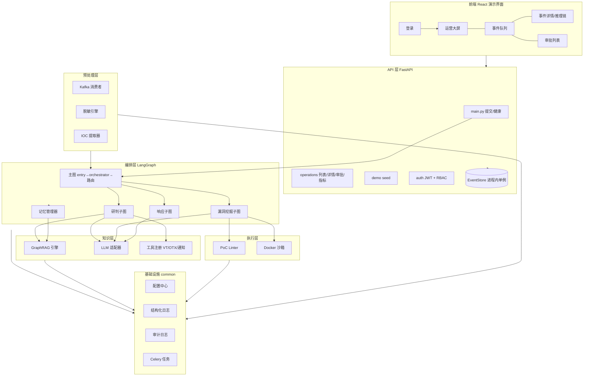
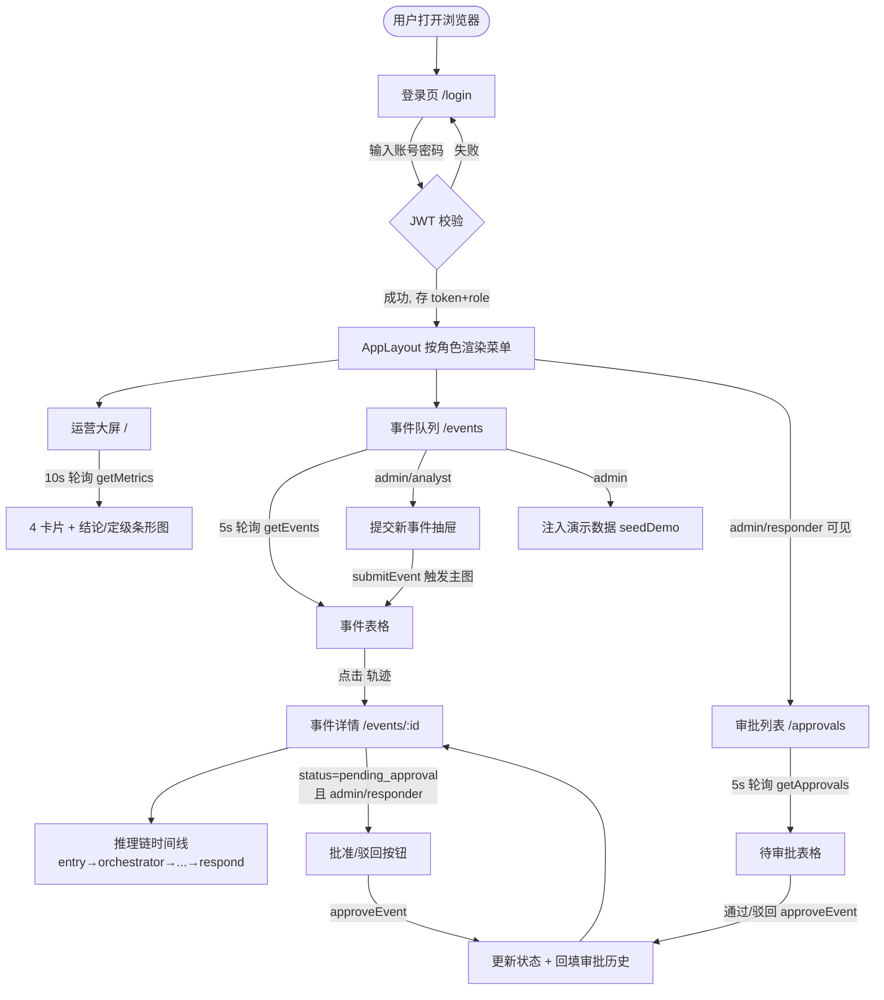
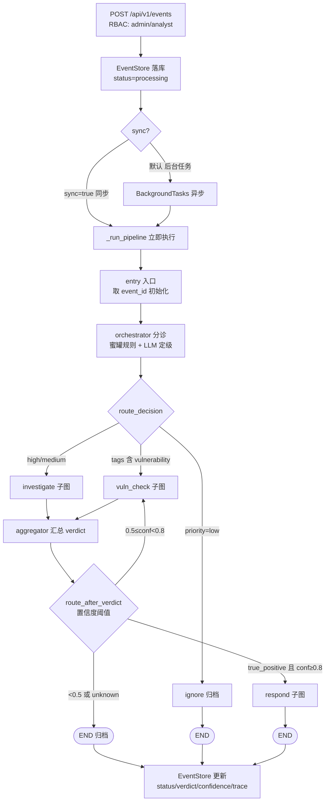
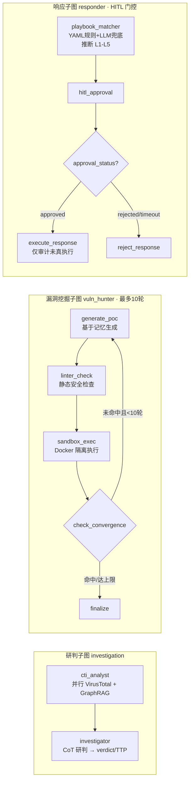
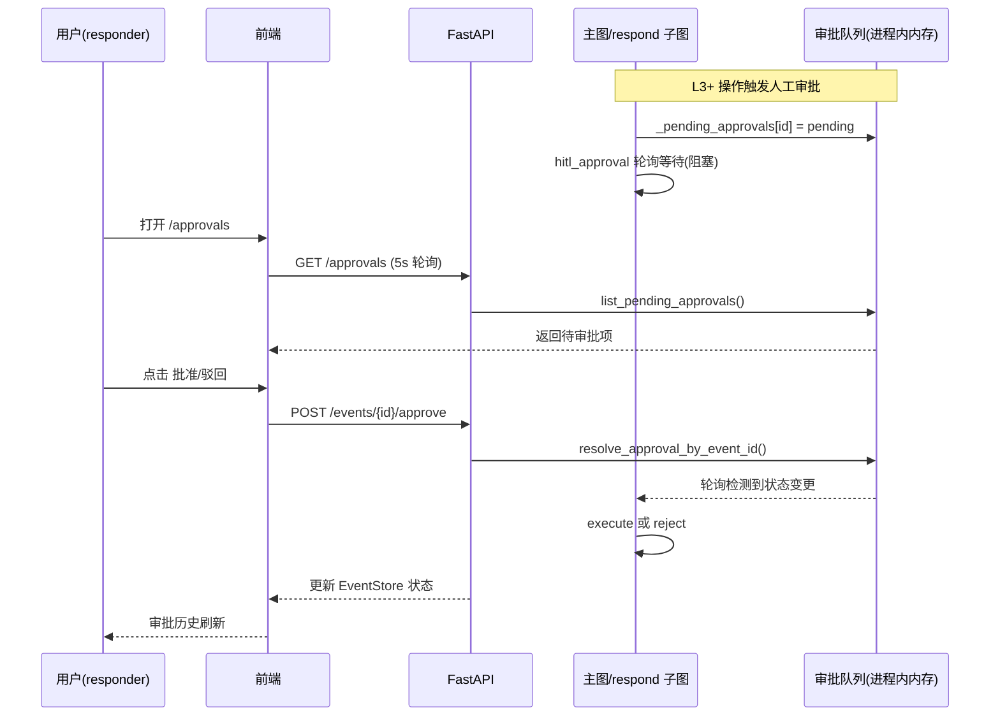

# 安全 AI Agent — 项目架构与流程说明

> 编制日期：2026-07-13
> 用途：项目全景梳理，供后续功能开发定位模块与扩展点使用。
> 配套文档：《前后端开发文档.md》《功能测试文档.md》

---

## 一、系统总览

一句话概括架构：

**Kafka 告警 → 预处理（脱敏 + IOC 提取）→ LangGraph 主图分诊 → 三条子图流水线（研判 / 漏洞挖掘 / 响应）→ FastAPI 暴露给 React 演示界面。**

底层由两个能力层支撑：
- **知识层**：GraphRAG（Milvus 向量 + Neo4j 图谱 + Redis 缓存）、统一 LLM 适配器、威胁情报与通知工具。
- **执行层**：PoC 静态检查（linter）+ Docker 沙箱隔离执行。

横切基础设施：配置中心、结构化日志、审计日志、Celery 异步任务。

---

## 二、分层架构图

---

## 三、目录与文件职责

### 3.1 后端 `src/`

#### `preprocessing/` — 告警接入预处理层
| 文件 | 作用 |
|------|------|
| `consumer.py` | Kafka 消费入口，驱动"脱敏→IOC 提取→输出"流水线，含死信队列。`_emit()` 是接下游编排的**预留钩子（未落地）** |
| `sanitization/engine.py` | 脱敏引擎：加载 YAML 规则、匹配、解决重叠、替换；watchdog 热重载 |
| `sanitization/mask.py` | 脱敏数据模型（`Rule`/`Span`）+ 掩码算法（占位符逻辑硬编码在此） |
| `rules/default_rules.yaml` | 8 条脱敏规则（密码/密钥/手机/邮箱/身份证/哈希）。**改这里即热生效** |
| `ioc_extractor/extractor.py` | 正则提取 IP/域名/hash/URL，过滤内网地址 |

#### `orchestration/` — LangGraph 编排层（核心大脑）

**主图 `main_graph/`**
| 文件 | 作用 |
|------|------|
| `graph.py` | 主图装配 + 两个路由：`route_decision`（分流）、`route_after_verdict`（置信度阈值） |
| `state.py` | `MainGraphState` 全图共享状态 |
| `nodes/entry.py` | 入口节点：取 event_id、初始化状态（docstring 说校验但**实际没做校验**） |
| `nodes/orchestrator.py` | 分诊节点：蜜罐规则短路 + LLM 定级，产出 `priority`/`event_tags` |
| `nodes/aggregator.py` | 汇总 verdict/confidence；`ignore_node` 归档噪音 |

**研判子图 `subgraphs/investigation/`**（线性：cti_analyst → investigator）
| 文件 | 作用 |
|------|------|
| `graph.py` | 装配线性链路 |
| `state.py` | `InvestigationSubState` 契约 |
| `cti_analyst.py` | 情报收集：并行查 VirusTotal + GraphRAG，产出 `IntelCard` |
| `investigator.py` | CoT 研判：产出 verdict/confidence/evidence/MITRE TTP |

**漏洞挖掘子图 `subgraphs/vuln_hunter/`**（带回环，最多 10 轮）
| 文件 | 作用 |
|------|------|
| `graph.py` | 装配迭代图：generate→lint→sandbox→收敛判定 |
| `state.py` | `VulnHunterSubState`，内嵌记忆对象 |
| `memory.py` | `VulnHunterMemory` 抗遗忘记忆（负面证据/约束/候选） |
| `poc_generator.py` | 全部节点逻辑：生成 PoC、静态检查、沙箱执行、`check_convergence` |

**响应子图 `subgraphs/responder/`**（带 HITL 审批门控）
| 文件 | 作用 |
|------|------|
| `graph.py` | 装配：playbook 匹配→HITL 审批→执行/拒绝 |
| `state.py` | `ResponderSubState` 契约 |
| `playbook_matcher.py` | 剧本匹配（YAML 规则 + LLM 兜底）+ 风险分级 L1–L5 |
| `hitl_handler.py` | 审批队列（进程内内存）、`list_pending_approvals`、执行/拒绝节点。`execute_response` **仅审计不真执行** |
| `../playbooks/*.yaml` | 10 个处置剧本（勒索/钓鱼/横向移动等）。**加剧本主要改这里** |

**记忆 `memory/manager.py`** — 证据记忆管理器（Milvus+Neo4j+Redis 去重）

#### `knowledge/` — 知识与外部能力层
| 文件 | 作用 |
|------|------|
| `graphrag/engine.py` | 混合检索：向量+图并行 + RRF 融合 + Redis 缓存 |
| `graphrag/graph/neo4j_client.py` | Neo4j 图谱二跳邻居查询（只读） |
| `graphrag/vector/milvus_client.py` | Milvus 向量库封装（建集合/检索/写入） |
| `graphrag/vector/embedding.py` | bge-large-zh 本地向量化，1024 维 |
| `models/adapter.py` | 统一 LLM 接入（Claude/OpenAI/vLLM），结构化输出 |
| `tools/registry.py` | 工具注册中心，`@tool` 装饰器。**新增外部能力入口** |
| `tools/virustotal.py` / `otx.py` | 威胁情报查询（目前都硬编码 IP 类型） |
| `tools/notifier.py` | 企微/钉钉 webhook 通知 |

#### `execution/` — PoC 执行层
| 文件 | 作用 |
|------|------|
| `linter/poc_linter.py` | PoC 静态安全检查（语法/import 白名单/危险调用） |
| `sandbox/executor.py` | Docker 沙箱执行（内存/CPU/只读/seccomp 约束） |

#### `common/` — 横切基础设施
| 文件 | 作用 |
|------|------|
| `config/settings.py` | 全局配置中心（pydantic-settings）。**新增配置的统一落点** |
| `logging/logger.py` | structlog 结构化日志 + PII 脱敏 |
| `audit/audit_logger.py` | ES 审计日志写入器 |
| `celery_app.py` | Celery 异步任务（目前仅审批超时） |

#### `api/` — HTTP 层（FastAPI）
| 文件 | 作用 |
|------|------|
| `main.py` | 应用入口：`submit_event`（异步跑主图 + `sync` 参数）、`/health`、CORS |
| `store.py` | `EventStore` 进程内单例：事件全生命周期 + trace + 审批 + metrics |
| `routers/operations.py` | 事件列表/详情/trace、`/approvals`、`/approve`、`/metrics` |
| `routers/demo.py` | `/demo/seed` 注入 5 类样例事件 |
| `auth/jwt.py` | JWT 签发/校验 + 内存用户库（4 账号） |
| `auth/routes.py` | `/auth/login`、`/auth/me`、`require_role()` RBAC |

### 3.2 前端 `frontend/src/`
| 文件 | 作用 |
|------|------|
| `main.tsx` | 根渲染入口（BrowserRouter 包裹） |
| `App.tsx` | 路由表 + AuthProvider + 登录守卫 |
| `types.ts` | 唯一数据契约（EventRecord/TraceStep/Approval/Metrics） |
| `context/AuthContext.tsx` | 全局认证 + RBAC 数据源（token 存 localStorage） |
| `api/client.ts` | axios 实例 + 所有 API 函数。**新接口加这里** |
| `components/AppLayout.tsx` | 侧边菜单框架 + 按角色显隐 |
| `pages/LoginPage.tsx` | 登录页 |
| `pages/DashboardPage.tsx` | 运营大屏（4 卡片 + 手写条形图，10s 轮询） |
| `pages/EventQueuePage.tsx` | 事件队列表格 + 提交抽屉（5s 轮询） |
| `pages/EventDetailPage.tsx` | 事件详情/推理链时间线（**演示核心**） |
| `pages/ApprovalsPage.tsx` | 审批列表 |

---

## 四、功能流程图

### 4.1 用户交互全景（前端视角）

### 4.2 事件提交后的后端处理流（LangGraph 主图）

**分流规则**：`priority=low → ignore`；`tags 含 vulnerability → vuln_check`；`high/medium → investigate`
**阈值路由**：`verdict=true_positive 且 conf≥0.8 → respond`；`0.5≤conf<0.8 → vuln_check`；否则归档

### 4.3 三个子图内部流

### 4.4 HITL 人工审批的跨界交互（前端 ⇄ 后端）

---

## 五、加功能扩展点速查

按改动成本从低到高：

**零改码（改配置即生效）**
- 加脱敏规则 → `preprocessing/rules/default_rules.yaml`
- 加处置剧本 → `orchestration/playbooks/*.yaml`
- 加配置项 → `common/config/settings.py`

**加外部能力（照现有模式）**
- 加情报源/通知渠道/动作 → `knowledge/tools/` 下写文件 + `@tool` 注册（注意要确保模块被 import）
- 加前端页面 → `pages/` 建组件 + `App.tsx` 加路由 + `AppLayout.tsx` 加菜单 + `client.ts` 加 API

**加分析/处置能力（建子图）**
- 新建 `subgraphs/xxx/`（state.py 契约 + 节点 + graph.py 装配），再在 `orchestrator.py` 的 event_tags 和主图 `route_decision` 接线

---

## 六、已知待修的"地雷"（真实代码中发现，非推测）

加功能前建议优先处理，否则新功能易踩坑：

1. **真实提交事件的 trace details 恒为空** — `main.py:_run_pipeline` 硬编码 `details={}`，主图 `audit_log` 只有 node/ts/summary。真实事件在详情页看不到 verdict/IOC/PoC 明细，只有 seed 假数据丰富。
2. **前后端端口不一致** — `vite.config.ts`/`client.ts` 指向 8001，后端 `settings.py` 是 8000。
3. **MemoryManager 实际不写向量库** — 调用方（cti_analyst）不传 embedding，`store_evidence` 只在有 embedding 时才写 Milvus。
4. **审批队列进程内内存** — 多 worker 不可见，演示必须单进程运行。
5. **情报工具只支持 IP** — VT/OTX 的 domain/hash/url 端点与解析不正确。
6. **e2e 测试脚本已过时** — `tests/e2e/test_scenarios.py` 用旧契约（提交不带 token、期望 `status=="processed"`、读 `events_by_status`），第一步就 401。
7. **execute_response 仅审计不真执行** — 响应子图末端是半成品。
8. **SanitizationEngine watchdog 线程泄漏** — 每个实例启动 Observer 且从不停止，多实例场景有隐患。

---

## 七、技术债汇总（文档声明的后续项）

- 审批队列外置 Redis，支持多 worker / 多进程
- 事件持久化到 ES/DB（当前内存仓，重启即失）
- `execute_response` 接入真实处置动作
- `consumer._emit` 接入主图，打通 Kafka 实时告警入口
- SSE/WebSocket 替代轮询，实时推送轨迹
- 前端 API 响应强类型、错误边界、E2E 测试
- Dashboard 引入图表库（当前手写 div 条形图）
